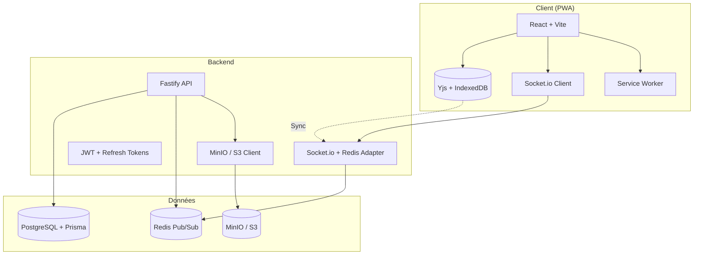

# Mino-Chat

> Messagerie temps réel, local-first, offline-capable — simple, solide, fluide.

## 🎯 Vision

- **Simple** : Architecture claire, code lisible, peu de dépendances
- **Solide** : Type-safe end-to-end, tests, error handling, observabilité
- **Fluide** : Optimistic UI, local-first (Yjs), PWA, temps réel natif

## 🏗 Architecture



## 🛠 Stack Technique

| Layer    | Choix                            | Justification                               |
| -------- | -------------------------------- | ------------------------------------------- |
| Backend  | Fastify + Socket.io + Prisma     | Perf, WebSocket natif, type-safe ORM        |
| Frontend | React 18 + Vite + TanStack Query | DX, cache intelligent, mutations optimistes |
| Sync     | Yjs + IndexedDB + WebSocket      | CRDT, offline-first, multi-device           |
| DB       | PostgreSQL + SQLite (local)      | Relational + embedded                       |
| Storage  | MinIO / S3-compatible            | Self-hostable, standard                     |
| Infra    | Docker + Fly.io/Railway          | Simple deploy, WebSocket support            |

## ✨ Fonctionnalités

### MVP (v1.0)

- [ ] Auth: email/password + magic link
- [ ] Conversations 1-to-1 & groupes
- [ ] Messages texte, images, fichiers
- [ ] Temps réel (Socket.io)
- [ ] Optimistic UI + Yjs sync
- [ ] PWA installable + offline queue
- [ ] Recherche messages (PostgreSQL FTS)

### Roadmap

- [ ] v1.1: OAuth (GitHub, Google), Passkeys
- [ ] v1.2: Push notifications (Web Push)
- [ ] v1.3: E2E Encryption (MLS/Signal)
- [ ] v1.4: Appels audio/vidéo (WebRTC)
- [ ] v1.5: Bots, webhooks, API publique

## 🚀 Démarrage Rapide

```bash
# Prérequis: Node 20+, Docker, pnpm
git clone https://github.com/votre-org/mino-chat.git
cd mino-chat
pnpm install
docker compose up -d  # Postgres, MinIO, Redis
pnpm db:migrate
pnpm dev              # Lance server + web
```

Accès :

- **Web App** : http://localhost:5173
- **API** : http://localhost:3000
- **MinIO Console** : http://localhost:9001
- **Prisma Studio** : `pnpm db:studio`

## 📁 Structure Projet

```
mino-chat/
├── apps/
│   ├── server/          # Fastify API + Socket.io
│   └── web/             # React + Vite + PWA
├── packages/
│   ├── shared/          # Types, Zod schemas, constants
│   ├── db/              # Prisma schema + client
│   └── ui/              # Composants partagés (optionnel)
├── turbo.json
├── docker-compose.yml
└── README.md
```

## 🔧 Commandes Utiles

| Commande          | Description              |
| ----------------- | ------------------------ |
| `pnpm dev`        | Dev server (hot reload)  |
| `pnpm build`      | Build production         |
| `pnpm test`       | Tests unit + integration |
| `pnpm test:e2e`   | Tests Playwright         |
| `pnpm lint`       | ESLint + Prettier        |
| `pnpm typecheck`  | TypeScript strict        |
| `pnpm db:studio`  | Prisma Studio            |
| `pnpm db:migrate` | Migrations + seed        |
| `pnpm db:seed`    | Seed development data    |
| `pnpm format`     | Prettier write           |

## 🧪 Tests

- **Unit** : Vitest (services, hooks, utils)
- **Integration** : Vitest + Testcontainers (API, DB)
- **E2E** : Playwright (flux critiques)
- **Coverage cible** : >80% core modules

```bash
# Lancer tous les tests
pnpm test

# Tests E2E headed (visible)
pnpm test:e2e --headed

# Coverage report
pnpm test:coverage
```

## 📦 Déploiement

- **Staging** : Auto sur push (preview deployments)
- **Prod** : Tag `v*` → GitHub Actions → Build → Deploy
- **Infra** : Fly.io (server) + Neon (Postgres) + Cloudflare R2 (S3) + Cloudflare CDN

### Variables d'environnement requises

```env
# Server
DATABASE_URL=postgresql://...
JWT_SECRET=...
JWT_REFRESH_SECRET=...
MINIO_ENDPOINT=...
MINIO_ACCESS_KEY=...
MINIO_SECRET_KEY=...
MINIO_BUCKET=mino-chat
REDIS_URL=redis://...
CORS_ORIGIN=https://app.mino.chat

# Web
VITE_API_URL=https://api.mino.chat
VITE_WS_URL=wss://api.mino.chat
```

## 🤝 Contribuer

1. Fork → Branche `feat/...` ou `fix/...`
2. Conventional Commits (`feat:`, `fix:`, `chore:`, `docs:`, `refactor:`)
3. PR → CI verte → Review → Merge (squash)

### Workflow git

```bash
git checkout -b feat/nouvelle-fonctionnalite
# ... commits
git push origin feat/nouvelle-fonctionnalite
# Ouvrir PR sur GitHub
```

## 📄 License

MIT — Voir [LICENSE](LICENSE)

---

## 🙋 Pourquoi Mino-Chat ?

| Besoin                  | Solutions existantes                   | Mino-Chat                               |
| ----------------------- | -------------------------------------- | --------------------------------------- |
| **Simple à héberger**   | Matrix (complexe), Rocket.Chat (lourd) | Docker compose unique, < 5 services     |
| **Offline-first**       | Peu (Signal desktop seulement)         | Yjs + IndexedDB + Background Sync natif |
| **Type-safe fullstack** | Rare (tRPC récent)                     | End-to-end TypeScript + Zod + Prisma    |
| **Propriété données**   | SaaS verrouillés                       | Self-hosted, vos données, votre serveur |
| **Moderne DX**          | Codebases legacy                       | Stack 2024, hot reload, testing moderne |
